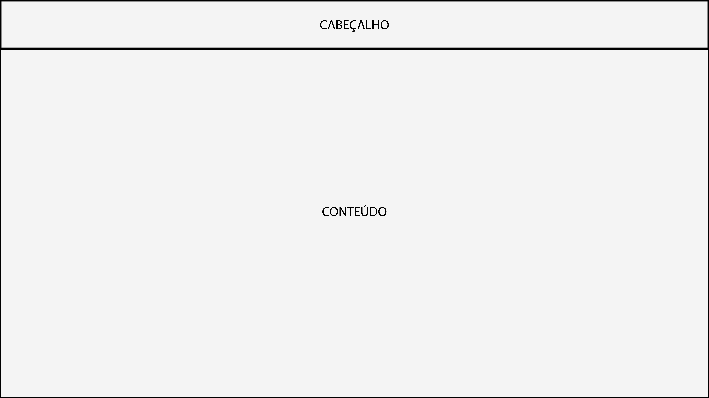
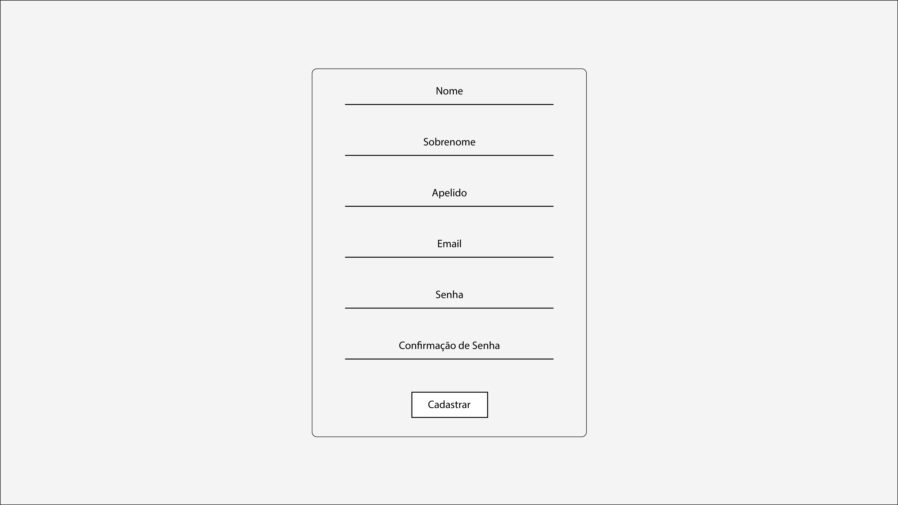

# Interface Design

The project has a standardized visual identity between the screens to facilitate the flow and navigability of the user, in addition, there is the intention to follow the standard already adopted by the main Streaming sites of today, with the objective of achieving an already known and comfortable environment for the end users.

As this is a system that requires the user to achieve the desired objective in correlating titles with preferences and the possibility of personalization, it is noted the need for the user to actively participate in the platform in order to obtain the desired result. Therefore, it is understood that it is necessary to create a registration / user profile.

## User Flow (User Flow)

Figure A below shows the user's navigation flow through the screens of the proposed site. More details on the interactive wireframe at: [Marvel] https://marvelapp.com/prototype/71i5fe5

## Wireframes

As the flow of pages in the project shows, the screens have a standard structure among themselves, which is shown below. In this structure there are 2 large blocks that divide the page, they are:
**Header** – place where the logo of the site and its main pages will be displayed.
**Content** – Place that will present, for each screen, your personalized content.

The base structure of the project screens remains as simple and generic as possible so that we can specify each screen in the future.

## Registration Page

The registration page will be where the user will have his first contact with the platform. To avoid a possible counterintuitive appearance on this screen, which could lead to a loss of user interest, this page should present a clean, minimalist and intuitive appearance.

## Login Page

For the same reasons as the registration page, the login screen must also maintain a simple appearance. The login screen will be where the user will access the platform with previously registered credentials.

## Home page

The home page is the first screen that actually has some of the main features of the platform. It is the first page that contains the platform's standard in its structure, presenting the header to the user and bringing recommendations for titles in its content block.

## Search Page

The search page includes one of the main functionalities of the platform, the recommendation of titles through another. The page's content comprises a search bar where the user can enter a title, a search button and a sub-block where related titles will be displayed.

## Profile Page

The profile page will maintain personalized profile information for each user, such as photo, name, description, favorite titles and achievements on the site.

## Movie Page

When viewing movies is necessary, they must be presented on a new screen, containing your poster, name, description, note, comments, among others. To prove this function, the movie screen will be created. A page that will adapt to each selected title, meeting the needs of pages such as the profile page and title search page.

## Comment Page

The comment page will allow the user to enter a comment on a movie, thus helping another user to decide. The comment page should be simple and will be created as a popup.

